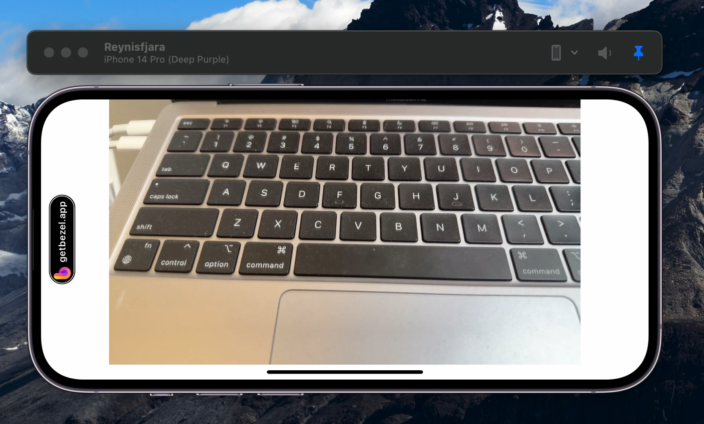

# Color invert filter 

This is a simplified version of our custom camera with a simple preview that only supports landscape left. The goal is to update `SampleBufferTransformer` to invert the colors.

**Original**

**Goal**

## Requirements 

- Implementation with Swift
- Fork repo and create a pull request with following 
  - Pull request should merge into your fork 
  - Briefly explain your approach
  - Possible improvements if you had more time
- Can ignore all error handling by using `fatalError()`
- Try not to spend more than 30 minutes for the task, maximum 1 hour
- Feel free to ask any questions or request tips if there's something unclear# iris
